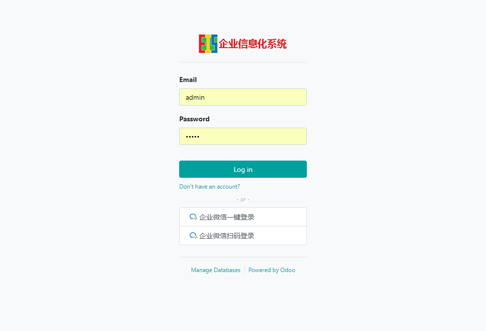
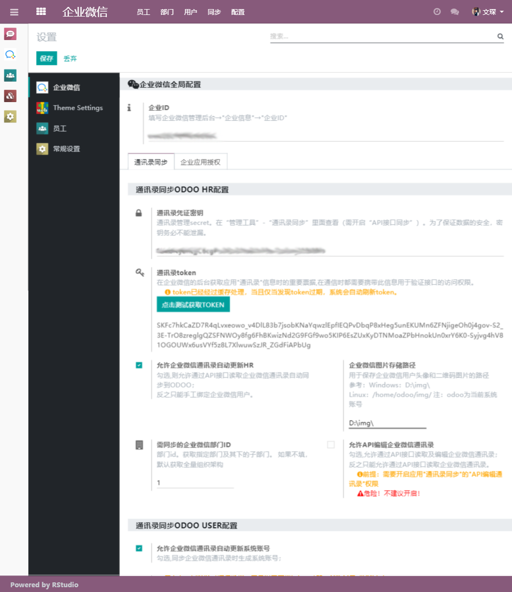
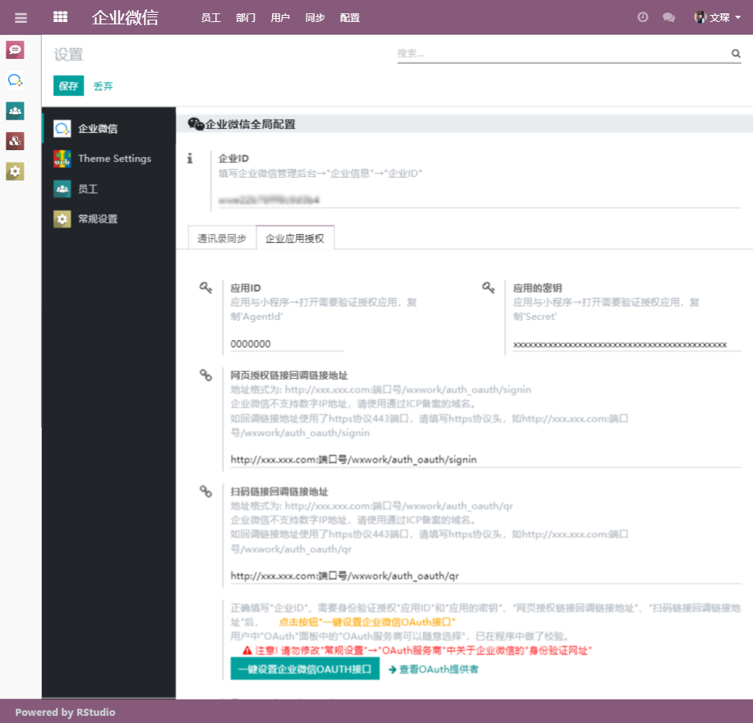
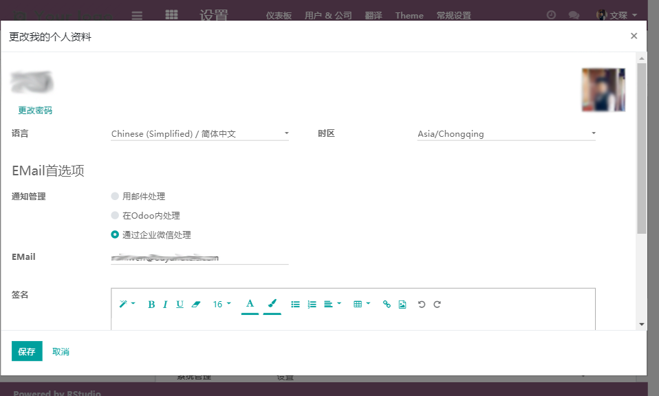

# 企业微信 For Odoo 12.0
[](doc/help/index.md)
[](doc/install/index.md)

**目前 同步通讯录和验证登陆可以正常使用了**  
_使用过程中发现错误，请参考帮助_

## 功能介绍

1. （完成）同步企业微信讯簿部门及人员到HR
2. （完成）系统任务同步和手动同步企业微信讯簿离职员工到HR
3. （完成）将头像和二维码下载方式由开始的载入内存改成使用多线程直接下载到本地，并判断本地与远程的一致性。
4. （完成）从HR中标记企微员工生成User(默认门户用户,随机密码)，可以在用户列表中"动作"中更改用户类型。  
    同步部门/员工/用户未使用多线程，测试发现，线程虽然飞快的跑完，但提交到数据库时，仍然缓慢的执行，意义不大。 
    - "内部用户"对于企业版来说付费账号，对于社区版来说会占用系统资源;  
    - "门户用户"是免费用户，仅可以访问前台网站，不占用系统资源.  
5. (完成)企业微信APP内一键登录,企业微信扫码登录
6. (进行中)企业微信通知功能，经同步过来的用户，系统通知默认通过企业微信处理
7. (进行中)企业微信重置密码，经一番研究，决定先开发出来企业微信的通知功能，让重置密码的信息直接发到企业微信去。业务流程也和Odoo一致，故将企业微信通知功能任务置前。


## 软件说明
1. wxwork_base  基础模块
2. wxwork_contacts  通讯簿同步模块
3. wxwork_auth_oauth 企业微信APP内一键登录,企业微信扫码登录
4. wxwork_reset_password 登录页面和后台用户首选项中使用扫码重置密码
5. wxwork_notice Odoo系统消息通知到企业微信 

###安装说明

1. 使用pip安装numpy、opencv-python,用于比较本地的图片（头像和二维码）和企业微信的是否一致
    ```bash
    pip install numpy opencv-python -i https://pypi.doubanio.com/simple
    ```

## 使用说明

1. 安装相关模块
2. 在"企业微信"→"设置"中进行配置，配置页面中有详细说明
3. 在部署在Debian上，进行企业微信同步测试，发现失败，查看日志发现有如下日志：
    ```bash
    odoo.service.server: Thread <Thread(odoo.service.cron.cron0, started daemon 140477819664128)> virtual real time limit (120/120s) reached.
    ```
   解决方案,在 /etc/odoo/odoo.conf 添加如下参数：
   ```editorconfig
   limit_time_cpu = 600
   limit_time_real = 1200 
   ``` 
   使用以下命令实时查看odoo运行日志，如发现CPU time limit和virtual real time limit，将limit_time_cpu和limit_time_real改动合适为止：
   ```bash
   tail -f /var/log/odoo/odoo-server.log 
    ```
4. 初次同步操作建议，向导同步→开启自动同步。

## 下载分支12.0 最新的代码到本地的wxwork文件夹

```bash
git clone git@gitee.com:rainbowstudio/wxwork.git --depth 1 --branch 12.0 --single-branch wxwork 
```

## 图片展示








